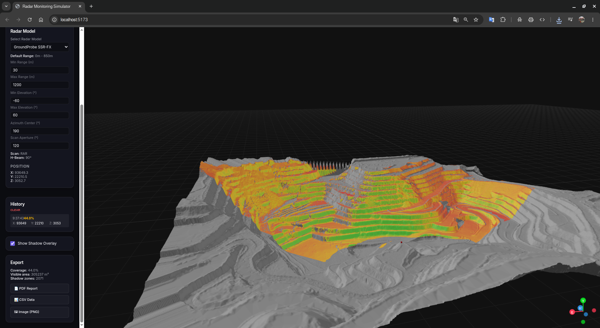
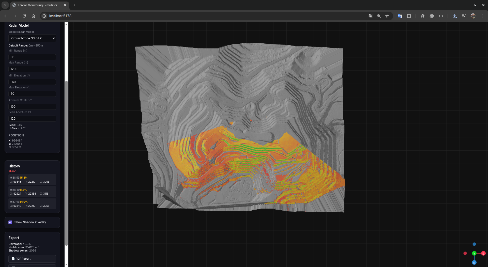
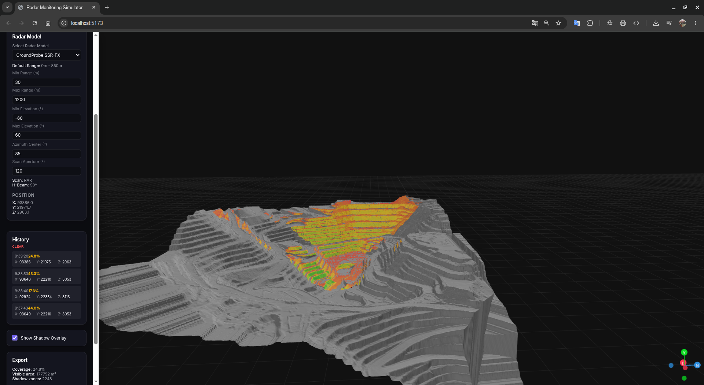
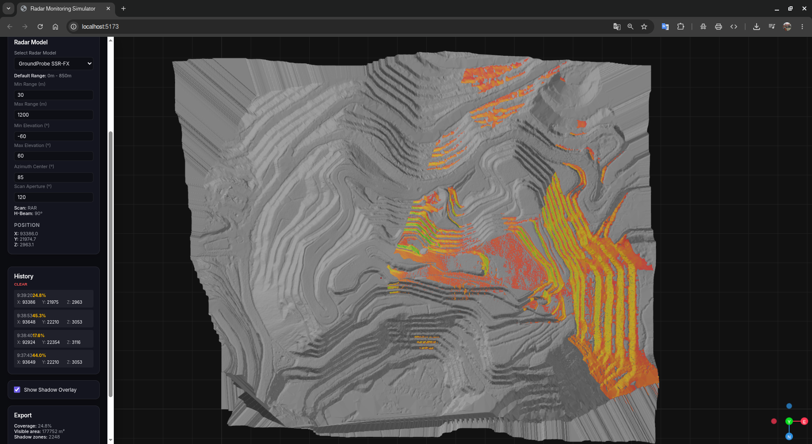
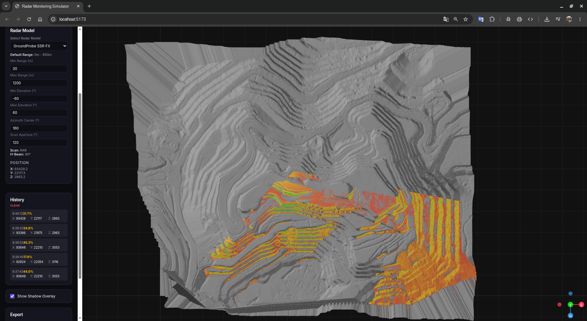

# 📡 GeotRadarSim — Radar Coverage Simulator for Geotechnical Monitoring

**Free, open-source, browser-based tool for simulating slope monitoring radar coverage on real mine topography.**

> Built by a geotechnical engineer, for geotechnical engineers.  
> Because radar positioning decisions should be based on data — not intuition.

🌐 **Live app:** [https://nibaldox.github.io/GeotRadarSim/](https://nibaldox.github.io/GeotRadarSim/)

---

## The Problem

In open-pit mining, monitoring radars (SSR, GroundProbe, IBIS, etc.) are critical for slope stability. Deciding **where** to place them is often done by staring at the pit topography in software like Vulcan and mentally figuring out:

- Which slopes can the radar actually **"see"**?
- Are there crests or benches creating **blind spots**?
- At 2,500 m range, is the **signal quality** still acceptable?
- If I add a **second radar**, does it cover the gaps?

This mental 3D exercise is unreliable. Commercial tools exist — but their licenses are expensive and not always accessible to every mine site.

**GeotRadarSim solves this.** It's free, runs in your browser, no installation required, and gives you answers in seconds.

---

## Features

| Feature | Description |
|---|---|
| 🗺️ **Real topography** | Load DXF contour lines or STL meshes from your mine survey |
| 🏗️ **Synthetic terrain** | Generate example hilly terrain for quick testing |
| 📡 **LOS analysis** | Ray-traced Line-of-Sight analysis with signal quality map |
| 🎯 **Radar parameters** | Override range, elevation, and azimuth per analysis |
| 🔴 **Multi-radar network** | Deploy multiple radars and compute unified coverage |
| 📊 **Coverage metrics** | Coverage %, visible area (m²), shadow zone count |
| 🕓 **History** | Click any past result to instantly restore the coverage overlay |
| 📄 **PDF Report** | Structured coverage report with tables |
| 📋 **CSV Export** | Full quality grid for post-processing |
| 🖼️ **PNG Snapshot** | Capture the 3D view as an image |
| 🌐 **100% browser** | No server, no Python, no installation |

---

## Screenshots

### Full Radar Coverage Analysis
Load your mine topography (STL or DXF), place a radar, and instantly see which slopes are covered. The color gradient shows signal quality — green = excellent, orange/yellow = moderate, red = poor.



### Coverage from Different Angles
Rotate and explore the 3D model to understand shadow zones and coverage gaps from every perspective.



### Comparing Radar Positions
Click different locations on the terrain to compare coverage. Each analysis is logged in the History panel.



### Shadow Zone Identification
Clearly identify which benches and slopes fall outside the radar's line of sight.



### Multi-Radar Network Analysis
Deploy multiple radars with different configurations and compute the unified coverage in one click.



---

## Quick Start

### Online (recommended)
Just open [https://nibaldox.github.io/GeotRadarSim/](https://nibaldox.github.io/GeotRadarSim/) — no installation needed.

### Run locally
```bash
git clone https://github.com/nibaldox/GeotRadarSim.git
cd GeotRadarSim/frontend
npm install
npm run dev
```
Open [http://localhost:5173/GeotRadarSim/](http://localhost:5173/GeotRadarSim/)

---

## How to Use

### Single Radar Analysis (3 steps)
1. **Load terrain** — upload a DXF or STL file, or click *Generate Synthetic Terrain*
2. **Configure radar** — select model and optional parameter overrides (range, elevation, azimuth)
3. **Click on terrain** — the radar is placed and analysis runs automatically

### Multi-Radar Network Analysis
1. Configure each radar and click on the terrain to place it
2. Click **"+ Add Current Radar to Network"** in the *Radar Network* panel
3. Repeat for each radar (each gets a unique color marker)
4. Click **"▶ Run Network Analysis"** — all radars run in parallel, unified coverage is displayed

### Supported Radar Models
| Model | Max Range | Pattern | Notes |
|---|---|---|---|
| GroundProbe SSR-FX | 850 m | RAR | Standard slope monitoring radar |
| IBIS-ArcSAR360 | 400 m | 360° SAR | Full azimuth, shorter range |
| Reutech MSR | 500 m | RAR | 120° aperture |

---

## Supported File Formats

| Format | Extension | How to export from Vulcan |
|---|---|---|
| DXF contours | `.dxf` | Export contour lines or 3D polylines at full Z |
| STL mesh | `.stl` | Export surface as triangulated mesh (ASCII or binary) |

> ⚠️ For DXF files: export as 3D polylines/points with Z values. 2D DXFs without elevation will produce a flat terrain.

---

## Technical Architecture

```
Browser Only — No Server Required
┌─────────────────────────────────────────────────┐
│  React + R3F (Three.js)                         │
│  ┌────────────────┐  ┌───────────────────────┐  │
│  │ Terrain Worker │  │    LOS Worker         │  │
│  │ (Web Worker)   │  │    (Web Worker)       │  │
│  │ STL/DXF parse  │  │  Raycasting + SNR     │  │
│  │ IDW interpolat │  │  Multi-radar merge    │  │
│  └────────────────┘  └───────────────────────┘  │
│  Zustand (state)  ·  jsPDF (exports)            │
└─────────────────────────────────────────────────┘
```

- **Terrain processing**: DXF/STL parsing + IDW interpolation → regular grid (DTM) in a Web Worker
- **LOS engine**: Ray-traced analysis per cell, azimuth/elevation filtering, signal quality (normal-weighted dot product × distance factor)
- **Multi-radar merge**: Union of visible cells (OR logic) + max quality per cell
- **No data leaves your browser** — everything runs locally

---

## Limitations & Known Issues

- DXF support depends on 3D polyline/point structure. Some CAD exports may require preprocessing.
- Very large terrains (>8192×8192 grid) may be slow or exceed GPU texture limits.
- The app runs on GPU WebGL — requires a hardware-accelerated browser (Chrome or Firefox recommended).
- PDF and CSV exports reflect the currently displayed analysis only.

---

## Roadmap

- [ ] Contour line labels and 2D plan view
- [ ] Radar beam cone visualization in 3D
- [ ] Multi-radar coverage comparison table
- [ ] Import/export of radar network configuration (JSON)
- [ ] Custom radar model editor
- [ ] Mobile-responsive layout

---

## Contributing

PRs welcome. This is an operational tool, so stability and accuracy are the priorities over feature velocity.

```bash
# Run tests
cd frontend && npm test

# Build for production
npm run build
```

---

## License

MIT — Free to use, modify, and distribute.

---

## About

Built by a mine site geotechnical engineer frustrated with the cost of commercial radar planning software.  
If this tool saves you time or helps you make a better radar placement decision, that's the goal.

Issues and suggestions welcome → [GitHub Issues](https://github.com/nibaldox/GeotRadarSim/issues)
