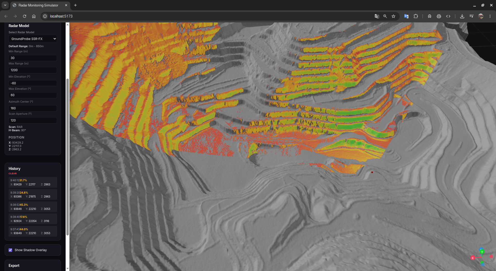

# 📡 GeotRadarSim — Radar Coverage Simulator for Geotechnical Monitoring

**Free, open-source tool for simulating slope monitoring radar coverage on real mine topography.**

> Built by a geotechnical engineer, for geotechnical engineers.  
> Because radar positioning decisions should be based on data — not intuition.

---

## The Problem

In open-pit mining, monitoring radars (SSR, GroundProbe, IBIS, etc.) are critical for slope stability. But deciding **where** to place them is often done by staring at the pit topography in software like Vulcan and trying to mentally figure out:

- Which slopes can the radar actually "see"?
- Are there crests or benches creating blind spots?
- At 2,500 meters, is the signal quality still acceptable?

This mental 3D exercise is unreliable. Commercial tools exist — but their licenses are expensive and not always accessible to every mine site.

**GeotRadarSim solves this.** It's free, runs in your browser, and gives you answers in seconds.

---

## Screenshots

### Full Radar Coverage Analysis
Load your mine topography (STL or DXF), place a radar, and instantly see which slopes are covered. The color gradient shows signal quality — green means excellent, orange/yellow means moderate, red means poor.


### Coverage from Different Angles
Rotate and explore the 3D model to understand shadow zones and coverage gaps from every perspective.


### Comparing Radar Positions
Click different locations on the terrain to compare coverage. Each analysis is logged in the History panel with coverage percentage and coordinates.


### Shadow Zone Identification
Clearly identify which benches and slopes fall outside the radar's line of sight. Grey areas = not monitored.


### Analysis History & Multiple Positions
Build a history of radar placement tests. Compare coverage percentages across different positions to find the optimal location.


### Close-up Signal Quality Gradient
Zoom in to see the continuous quality gradient on individual benches. The model accounts for both incidence angle and distance to produce realistic signal quality estimates.



---

## Signal Quality Model

The coverage color map is based on a physics-inspired quality model:

```
Quality = cos(incidence_angle) × distance_factor(d)
```

| Factor | Description |
|--------|-------------|
| **Incidence angle** | Angle between the radar beam and the slope surface normal. Steeper angles = weaker signal return. |
| **Distance factor** | Smoothed decay calibrated for modern radars. Uses `√(d/max_range)` exponent — reliable up to 2,500m. |

| Color | Quality | Meaning |
|-------|---------|---------|
| 🟢 Green | 0.7 – 1.0 | Excellent — strong signal return, reliable displacement data |
| 🟡 Yellow | 0.4 – 0.7 | Moderate — usable data, possible noise at longer ranges |
| 🟠 Orange | 0.2 – 0.4 | Marginal — data may require filtering or longer scan times |
| 🔴 Red | 0.0 – 0.2 | Poor — grazing angle or extreme distance, unreliable data |
| ⬜ Grey | — | Not covered — in shadow, outside scan aperture, or beyond range |

---

## Features

### 🗺️ Terrain
- **Import STL or DXF** files from your mine planning software (Vulcan, Surpac, Leapfrog, etc.)
- **Generate synthetic terrain** for testing and learning
- **Adjustable resolution** (0.5m to 5m grid)
- **GPU-accelerated rendering** with directional lighting for realistic 3D relief

### 📡 Radar Simulation
- **Pre-configured radar models** (GroundProbe SSR-FX, more coming)
- **Customizable parameters:** range, elevation angles, azimuth center, scan aperture
- **Click-to-place** radar position directly on the terrain
- **Automatic LOS analysis** with parallel CPU processing

### 📊 Results
- **Coverage percentage** calculated instantly
- **Visible area** in m²
- **Shadow zone count** 
- **Analysis history** — compare multiple positions

### 📤 Export
- **PDF Report** with coverage summary
- **CSV Data** for analysis in Excel or Python
- **PNG Image** for presentations and reports

---

## Quick Start

### Prerequisites
- **Python 3.10+** (backend)
- **Node.js 18+** (frontend)

### Backend

```bash
cd backend
pip install -r requirements.txt
uvicorn app.main:app --reload --port 8000
```

### Frontend

```bash
cd frontend
npm install
npm run dev
```

Open **http://localhost:5173** in your browser.

### Usage

1. **Load terrain:** Click "Upload DXF/STL" with your mine topography file, or "Generate Synthetic Terrain" for a demo.
2. **Select radar model:** Choose from the dropdown (e.g., GroundProbe SSR-FX).
3. **Place radar:** Click on the terrain where you want to position the radar.
4. **View coverage:** Check "Show Shadow Overlay" to see the quality gradient.
5. **Compare positions:** Click different locations — each analysis is saved in the History panel with its coverage percentage.
6. **Export:** Download PDF, CSV, or PNG for your records.

---

## Architecture

```
├── backend/                  # FastAPI (Python)
│   ├── app/
│   │   ├── api/              # REST endpoints (terrain, analysis)
│   │   ├── models/           # Domain models (BoundingBox, DTMMetadata)
│   │   ├── services/
│   │   │   ├── los_engine.py # Line-of-Sight + SNR quality model
│   │   │   ├── stl_parser.py # STL → DTM grid (scipy griddata)
│   │   │   ├── dxf_parser.py # DXF → point cloud
│   │   │   └── dtm_generator.py # Point cloud → regular grid
│   │   └── main.py
│   └── requirements.txt
│
├── frontend/                 # React + Three.js + R3F
│   ├── src/
│   │   ├── components/
│   │   │   ├── TerrainViewer.tsx   # 3D terrain (BufferGeometry + normals)
│   │   │   └── ShadowOverlay.tsx   # Coverage shader (GLSL + DataTexture)
│   │   ├── store/            # Zustand state management
│   │   ├── services/         # API client
│   │   └── utils/            # Terrain math utilities
│   └── package.json
│
├── img/                      # Screenshots from real mine data
└── docs/screenshots/         # Screenshots for README
```

---

## Roadmap

- [ ] Deploy to GitHub Pages (static frontend + serverless backend)
- [ ] Additional radar models (IBIS-FM, MSR, IDS Hydra-G)
- [ ] Multi-radar analysis (combine coverage from 2+ radars)
- [ ] Terrain texture maps (satellite imagery overlay)
- [ ] Elevation profile tool (cross-section through terrain)
- [ ] Spanish language UI
- [ ] Mobile-responsive layout

---

## Contributing

Contributions are welcome! Whether you're a geotechnical engineer with domain knowledge or a developer who wants to improve the tool.

```bash
git checkout -b feature/my-improvement
git commit -m "feat: add my improvement"
git push origin feature/my-improvement
```

---

## License

MIT — Use it, modify it, share it. No restrictions.

---

## About

Created by a geotechnical engineer who got tired of guessing where to put the radar.

If this tool helps you make better decisions at your mine site, that's all the reward I need. ⛏️
