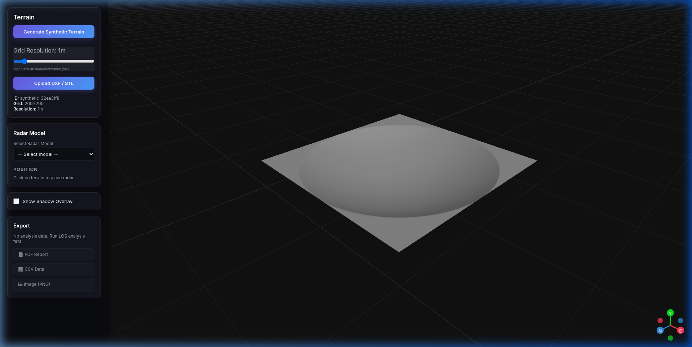
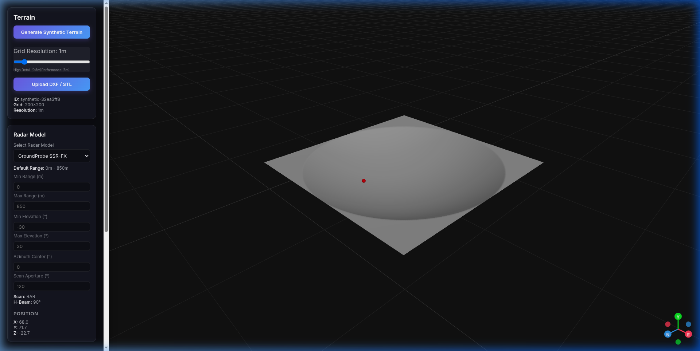
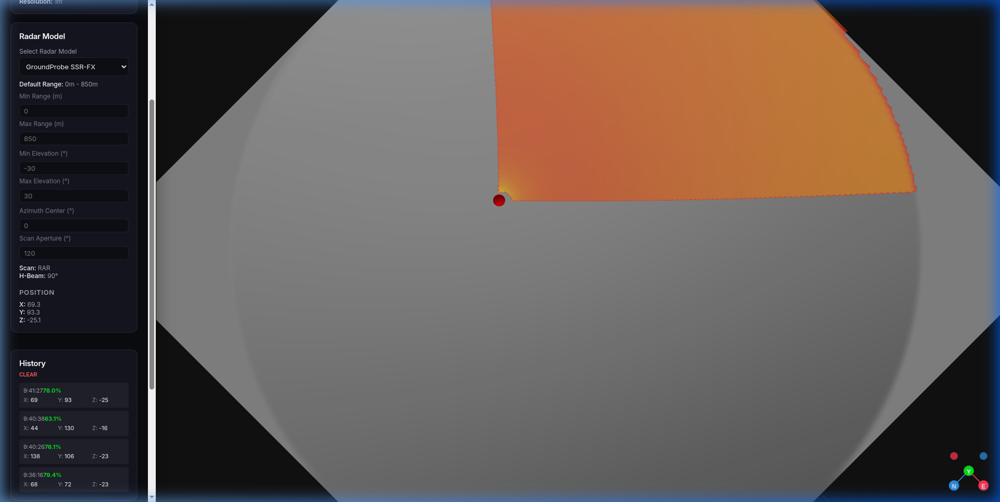
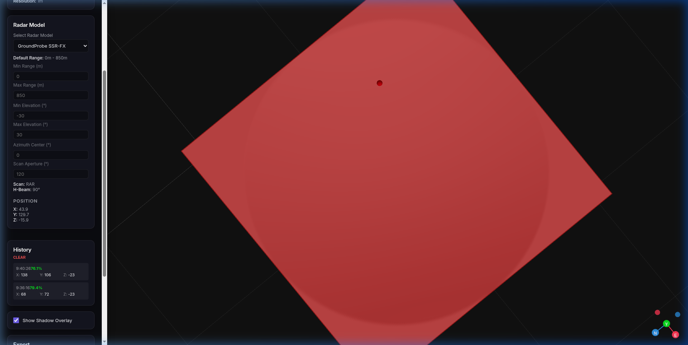

# 📡 GeotRadarSim — Radar Coverage Simulator for Geotechnical Monitoring

**Free, open-source tool for simulating slope monitoring radar coverage on mine topography.**

> Built by a geotechnical engineer, for geotechnical engineers.  
> Because radar positioning decisions should be based on data — not intuition.

---

## The Problem

In open-pit mining, monitoring radars (SSR, GroundProbe, IBIS, etc.) are critical for slope stability. But deciding **where** to place them is often done by staring at the pit topography in software like Vulcan and trying to mentally figure out:

- Which slopes can the radar actually "see"?
- Are there crests or benches creating blind spots?
- At 2,500 meters, is the signal quality still acceptable?

This mental 3D exercise is unreliable. Commercial tools exist — but their licenses are expensive and not always accessible to every mine site.

**GeotRadarSim solves this.** It's free, runs in your browser, and gives you answers in seconds.

---

## Screenshots

### Terrain Visualization
Load your mine topography (STL or DXF) and explore it interactively in 3D.



### Radar Configuration
Select a radar model, configure parameters, and click on the terrain to place the radar.



### Coverage Analysis
Instantly see which areas the radar covers. The color gradient shows signal quality:
- 🟢 **Green** → Excellent signal (close range, favorable incidence angle)
- 🟡 **Yellow/Orange** → Moderate signal (mid-range or oblique angle)
- 🔴 **Red** → Poor signal (far range, grazing angle)
- **Grey** → Not covered (shadow zone)



### Analysis History
Compare multiple radar positions. Each analysis is logged with coverage percentage and coordinates.



---

## Features

### 🗺️ Terrain
- **Import STL or DXF** files from your mine planning software
- **Generate synthetic terrain** for testing and learning
- **Adjustable resolution** (0.5m to 5m grid)
- **GPU-accelerated rendering** with realistic lighting and 3D relief

### 📡 Radar Simulation
- **Pre-configured radar models** (GroundProbe SSR-FX, and more coming)
- **Customizable parameters:** range, elevation angles, azimuth, scan aperture
- **Click-to-place** radar position directly on the terrain
- **Automatic LOS analysis** with parallel CPU processing (24 workers)

### 📊 Signal Quality Model
The coverage map uses a physics-based quality model:

```
Quality = cos(incidence_angle) × distance_penalty(d)
```

Where:
- **Incidence angle:** Angle between the radar beam and the slope normal. Higher angles = worse signal.
- **Distance penalty:** Smoothed decay function calibrated for modern radars (reliable up to 2,500m).

### 📤 Export
- **PDF Report** with coverage summary
- **CSV Data** for analysis in Excel or Python
- **PNG Image** for presentations

---

## Quick Start

### Prerequisites
- **Python 3.10+** (backend)
- **Node.js 18+** (frontend)

### Backend

```bash
cd backend
pip install -r requirements.txt
uvicorn app.main:app --reload --port 8000
```

### Frontend

```bash
cd frontend
npm install
npm run dev
```

Open http://localhost:5173 in your browser.

### Usage

1. **Load terrain:** Click "Generate Synthetic Terrain" for a demo, or "Upload DXF/STL" with your own file.
2. **Select radar model:** Choose from the dropdown.
3. **Place radar:** Click on the terrain where you want to position the radar.
4. **View coverage:** Check "Show Shadow Overlay" to see the quality map.
5. **Compare positions:** Click different locations — each analysis is saved in the History panel.

---

## Architecture

```
├── backend/                  # FastAPI (Python)
│   ├── app/
│   │   ├── api/              # REST endpoints (terrain, analysis)
│   │   ├── models/           # Domain models (BoundingBox, DTMMetadata)
│   │   ├── services/         # Core logic
│   │   │   ├── los_engine.py # Line-of-Sight + SNR quality model
│   │   │   ├── stl_parser.py # STL → DTM grid conversion
│   │   │   ├── dxf_parser.py # DXF → point cloud
│   │   │   └── dtm_generator.py # Point cloud → regular grid
│   │   └── main.py           # App entry point
│   └── requirements.txt
│
├── frontend/                 # React + Three.js + R3F
│   ├── src/
│   │   ├── components/
│   │   │   ├── TerrainViewer.tsx   # 3D terrain renderer (BufferGeometry)
│   │   │   └── ShadowOverlay.tsx   # GPU coverage shader (GLSL)
│   │   ├── store/            # Zustand state management
│   │   ├── services/         # API client
│   │   └── utils/            # Terrain math utilities
│   └── package.json
│
└── docs/screenshots/         # Screenshots for README
```

### Key Technical Decisions

| Decision | Why |
|----------|-----|
| **BufferGeometry** (not ShaderMaterial) for terrain | Vertex normals enable realistic lighting. GPU displacement shaders can't calculate normals per-vertex, making terrain look flat. |
| **ShaderMaterial** for coverage overlay | The quality map is a DataTexture sampled in GLSL. Avoids creating millions of colored vertices. |
| **Sentinel value -1.0** for shadows | Distinguishes "shadowed" from "visible with quality=0". The fragment shader discards only q < 0. |
| **DirectionalLight at 30-40°** | Grazing light reveals terrain relief. Perpendicular light makes everything look flat. |
| **ProcessPoolExecutor** for LOS | Ray-casting is CPU-bound and embarrassingly parallel. 24 workers on a modern CPU process 200×200 grids in seconds. |

---

## Roadmap

- [ ] Deploy to GitHub Pages (static frontend + API endpoint)
- [ ] Additional radar models (IBIS-FM, MSR, IDS Hydra-G)
- [ ] Terrain texture maps (satellite imagery overlay)
- [ ] Multi-radar analysis (combine coverage from 2+ radars)
- [ ] PDF report with coverage maps and statistics
- [ ] Elevation profile tool (cross-section through terrain)
- [ ] Spanish language UI

---

## Contributing

Contributions are welcome! Whether you're a geotechnical engineer with domain knowledge or a developer who wants to improve the tool — PRs, issues, and ideas are all appreciated.

```bash
# Fork, clone, create branch
git checkout -b feature/my-improvement

# Make changes, commit
git commit -m "feat: add my improvement"

# Push and create PR
git push origin feature/my-improvement
```

---

## License

MIT — Use it, modify it, share it. No restrictions.

---

## About

Created by a geotechnical engineer who got tired of guessing where to put the radar.

If this tool helps you make better decisions at your mine site, that's all the reward I need. ⛏️
